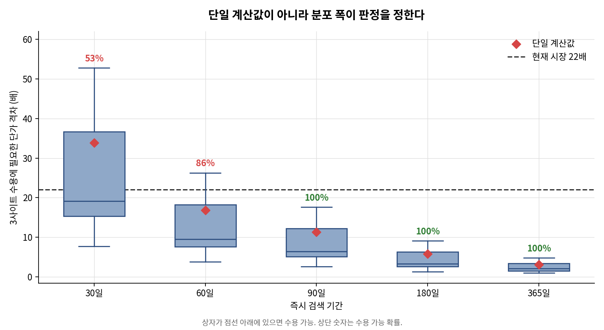

# Flash vs. Tiered Storage — A Total Cost of Ownership Analysis

> **Where should you invest to cut security-log storage costs: data reduction, or tiering?**
> A calculator for environments under a two-year log retention mandate.

The analysis began because flash and its alternatives had diverged in price, from 4.9x to 22.6x. **The conclusion turned out not to depend on that gap.**

---

## Findings

### 1. The benefit of tiering comes from index removal, not from the price gap

The opening hypothesis was that a widening price gap makes tiering attractive. **It was partly falsified.**

| Price ratio | All high-performance | Maximum tiering |
|---|---|---|
| **1x (identical price)** | 1.23M KRW | **0.49M KRW** |
| 22x (current market) | 89.3M KRW | 1.8M KRW |

**Tiering wins even at identical prices.** The archive tier drops its search index, so the storage coefficient falls from 0.50 to 0.15. The price gap only amplified an advantage that already existed.

### 2. The vendor's 6:1 reduction guarantee is physically unreachable for this workload

Confirmed against the guarantee's own terms:

> Examples of Unreducible Data include **host-compressed data**.

Log raw data arrives at the array already compressed. It is contractually outside the guarantee.

```
blended reduction = 0.50 / (0.15 + 0.35 / d)
→ ceiling of 3.33 even if the index compressed to zero bytes
```

### 3. The size of a point estimate does not guarantee the certainty of a verdict

Feasibility of adopting three-site distribution:

| Searchable period | Required price ratio | Gap vs. market (22x) | **Feasibility** |
|---|---|---|---|
| 30 days | 33.84x | 54% above | **51%** |
| 60 days | 16.84x | 24% below | 87% |
| 90 days | 11.30x | 49% below | **100%** |

**At 30 days the threshold sits 54% above the market ratio, which makes the verdict look settled. But the threshold itself ranges from 10.8 to 50.1, and its median of 19.3 falls below the market ratio.**



---

## Other findings

| # | Finding |
|---|---|
| 1 | **A blended reduction ratio of 1.538 and a block RAID overhead of 1.536 cancel almost exactly.** The two values came from independent sources |
| 2 | Array-vendor branded drives cost **2.8–3.9x** the raw media market price |
| 3 | A market index's disk series contradicts the manufacturer's SEC filing (+146% vs. +2.6%) |
| 4 | Under multi-site configuration, tiering **increases** physical capacity — yet still reduces cost |
| 5 | **Optimisation consumes headroom.** Organisations that have already tiered aggressively find added availability requirements harder to absorb |

---

## Method

### No forecasting

A price index published **three different ratios (16.4 / 22.6 / 23.2) for the same quarter**, and revised its own historical figure upward by 60%.

Rather than choosing one, the analysis **scans the price ratio from 3x to 30x**. The conclusion holds regardless of which index you trust.

### Verified against primary sources

| Source | What it established |
|---|---|
| **Vendor guarantee terms** | Host-compressed data explicitly excluded |
| **Seagate Form 10-Q** | Per-TB realised price derived from disclosed exabytes shipped |
| **Korean public procurement (4 awards)** | Actual transaction prices with capacity stated |
| **Corporate Tax Act, Enforcement Rule** | Replacement cycle of 4–6 years |

**The index's disk pricing was rejected** because it contradicted the manufacturer's financial statements. The code enforces this rejection.

### Cross-checked through an independent path

Retail media price × ratio (22) × OEM premium (3.3) = **2,450,976 KRW/TB**
Derived from Korean procurement awards = **2,856,538 KRW/TB**

Two unrelated paths agreed within **14%**.

---

## Documents

**Two kinds, with different purposes.**

| Document | Reader | Nature |
|---|---|---|
| **[phase08_proposal.md](docs/phase08_proposal.md)** | **Decision maker** | **The findings. Start here** (Korean) |
| `docs/phase00`–`phase07` | Author | **Working papers preserving the reasoning** (Korean) |

The working papers record every option considered and discarded, with reasons. Unless you are auditing the method, the proposal is enough.

---

## Reproducing

```bash
python -m venv .venv
source .venv/bin/activate
pip install -r requirements.txt

python -m pytest tests/ -q       # 124 checks
python src/make_charts.py        # 4 figures
```

### Structure

```
src/
  placement.py       logical capacity per tier
  overhead.py        overhead factor by configuration
  reduction.py       reduction applied → physical capacity
  pricing_loader.py  price ledger loader
  cost_model.py      physical capacity × unit price
  tco_engine.py      cost by contract term
  breakeven.py       break-even search
  sensitivity.py     sensitivity and uncertainty
  make_charts.py     figures

data/
  media_pricing.yaml  on-premises media cost (USD/TB)
  cloud_pricing.yaml  cloud service rate (USD/GB/month)
```

The two ledgers are separate files because their units and cost natures differ. Values are returned as objects carrying unit and provenance, so **mixing them raises an error rather than producing a plausible wrong number**.

```python
media.get_krw("hdd_manufacturer_realized") + cloud.get("object_price")
# UnitSystemError
```

### Checks that detect errors, not confirm success

| Check | Fails when |
|---|---|
| Double-reduction guard | Toggling compression state leaves the result **unchanged** |
| Rejected-value block | A rejected value **returns** instead of raising |
| Unit-system separation | Adding two ledgers **does not** raise |
| Explicit sensitivity list | Amortisation period is **absent** from the list |
| Figure accuracy | A plotted value **differs** from the engine |

---

## Limitations

**Two conditions must hold for the analysis to apply.**

| # | Condition | Status |
|---|---|---|
| 1 | Archive media can be procured | ⚠ **Nearline disk capacity allocated through 2027. Lead times exceed 52 weeks** |
| 2 | No immediate-query demand beyond the boundary | ⚠ **The archive tier is not searchable; recovery is a manual operation** |

**Weakly grounded inputs are stated as such.**

| Item | Limitation |
|---|---|
| Index reduction ratio | No measurement. Sampled uniformly over 1.0–6.0 |
| Multi-site overhead of 5.76 | Derived from **a single procurement record** |
| 90% stability threshold | **Set without a cited basis.** Lowering it to 80% moves the recommendation from 90 to 60 days |
| Procurement constraint | Based on overseas vendor statements. **Korean channel inventory unverified** |

**Figures are storage media cost, not total cost of ownership.** Power, floor space, maintenance and installation labour were excluded for lack of a defensible basis.

---

## Preceding analysis

[SIEM Build vs. Buy TCO Analysis](https://github.com/eugeejo-ui/siem-build-vs-buy-tco)

The engine structure and verification approach were carried over. **The modules themselves were rewritten** — the ledger schema differs, and unit-system separation and rejected-value blocking were new requirements.

---

[한국어](README.ko.md)
