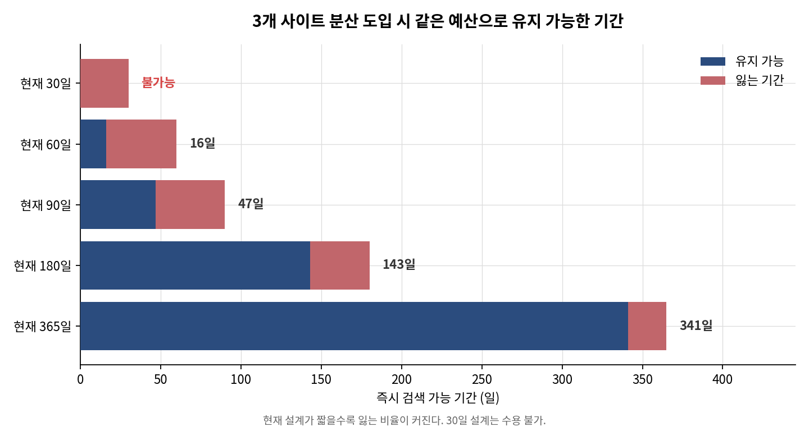
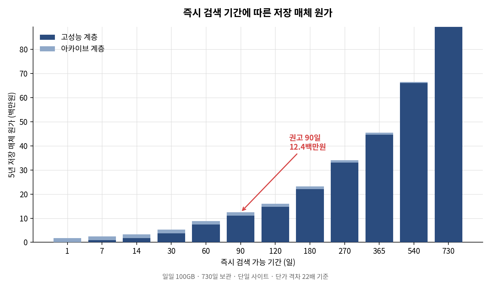

> **[한국어](README.ko.md)** · This is the English edition.

---

# Flash vs. Tiered Storage — A Total Cost of Ownership Analysis

**How should security-log storage costs be reduced under a two-year retention mandate?**

This repository holds a calculator for deciding where to invest — data reduction or tiering — and a record of the reasoning that led to that decision.

| Item | Detail |
|---|---|
| Period | 4–6 September 2026 |
| Stages | Phase 0 – 10 (all complete) |
| Deliverables | 11 documents, 10 calculation modules, 288 checks, 4 figures |
| Nature | Deterministic total-cost modelling. Time-series forecasting excluded |

---

## 1. Background

### 1.1 A shift in market conditions

Since 2025 the per-terabyte price gap between flash and its alternatives has widened sharply.

| Period | Flash-to-disk price ratio |
|---|---|
| Q2 2025 | 4.9x |
| Q1 2026 | 23.2x (peak) |
| Q3 2026 | 18.6x |

Three causes account for this.

1. **NAND contract prices surged.** They rose 33–38% quarter-on-quarter in Q1 2026, and enterprise SSD contract prices rose roughly 80% over the same period.
2. **The rise continued.** In Q2 2026, NAND contract prices rose a further 70–75%, outpacing DRAM for the first time in this cycle.
3. **Supply-side structure changed.** Nearline disk manufacturers decided against expanding production capacity, so procurement conditions for the alternative tier deteriorated as well.

### 1.2 Why this analysis was undertaken

A widening price gap may **shift the optimum of a storage design**. Two questions remained unanswered.

1. How wide must the gap become before a design change is warranted?
2. Under what conditions does that judgement reverse?

The engine structure and verification approach were inherited from a **preceding analysis** ([SIEM Build vs. Buy TCO](https://github.com/eugeejo-ui/siem-build-vs-buy-tco)). The modules themselves were rewritten, because the ledger schema differs and unit-system separation was a new requirement.

---

## 2. Situation Analysis

### 2.1 The environment under study

| Item | Value | Basis |
|---|---|---|
| Sector | Mid-sized Korean e-commerce | — |
| Retention mandate | Two years (730 days) of access logs | Korean personal-data safeguards standard, Article 8 |
| Daily log volume | Input variable (not estimated) | Varies by organisation |
| Current configuration | All data held on the high-performance tier | — |

### 2.2 How the storage tiers are structured

A log platform stores data in two forms.

| Form | Composition | Share of original |
|---|---|---|
| Searchable | Raw data + search index | **0.50** |
| Archived | Raw data only (index removed) | **0.15** |

**The search index accounts for 70% of stored volume.** Raw data is already compressed to 15% of its original size; the index adds a further 35% on top of it.

### 2.3 A reliability problem in the price data

A problem with the price sources surfaced immediately after commencement.

1. **A single index published three different ratios for the same quarter.** For Q1 2026 it reported 16.4x, 22.6x and 23.2x, the difference arising from three distinct comparison bases (broad average, 30TB TLC, 30TB QLC).
2. **The publisher revised its own historical figure.** The Q1 2026 TLC price, first reported as $10,950 in January, was raised to $17,500 in the June update.
3. **The publisher is a hybrid-storage vendor.** As a self-published index, bias cannot be ruled out.

**A design that does not rely on any single value was therefore required.** This judgement governed the entire methodology that followed.

---

## 3. Problem Definition

### 3.1 The opening question

> **"Now that the price gap has widened, which of the two levers deserves investment — and at what ratio does the answer reverse?"**

Two levers were set as the objects of comparison.

| Lever | Mechanism | Control variable |
|---|---|---|
| A. Data reduction | Shrinks physical footprint within the same tier | Reduction ratio |
| B. Tiering | Moves data to a lower-priced tier | Searchable period |

### 3.2 Methodological declaration — no forecasting

**Deterministic total-cost modelling was adopted, and time-series forecasting was explicitly excluded.**

Rather than forecasting price, the analysis treats it as a **scan axis**: the observed lower and upper bounds define an interval, and the interval is traversed. Two reasons support this.

1. **Shelf life of the result.** A price forecast for a given date expires on that date. A statement of the form "the judgement reverses at ratio X" remains valid as prices move.
2. **The reliability problem in §2.3.** Choosing any single value would make that choice the conclusion.

The design was subsequently validated on four occasions.

| Stage | What was confirmed |
|---|---|
| Phase 2 | Three index series coexist, and a historical figure had been revised |
| Phase 4 | Flash price is generated from the ratio, so index choice no longer affects the conclusion |
| Phase 6 | Break-even is numerically independent of archive baseline, OEM premium and log volume |
| Phase 10 | An automated check enforces that no representative value is set |

### 3.3 Items excluded from scope

Items without a defensible basis were left out of the calculation, and the exclusion was recorded.

| Excluded item | Reason | Handling |
|---|---|---|
| 1. Power, floor space, cooling | Korean data-centre power tariffs form a separate research unit | Follow-on work |
| 2. Performance (IOPS, latency) | No basis for monetary conversion | Qualitative treatment |
| 3. Maintenance and installation labour | Wide vendor-to-vendor variance, not disclosed | Results labelled as media cost only |
| 4. NAND price forecasting | Per the methodological declaration | Excluded |
| 5. Product-level performance benchmarks | This is an architecture decision, not a product comparison | Excluded |

---

## 4. Hypotheses

### 4.1 Hypothesis H1 — a crossover exists

> The benefit of reduction is bounded by a divisor of 6. The benefit of tiering is a divisor of R (observed at roughly 22). As R grows, tiering therefore comes to dominate reduction, and **a crossover exists between the two.**

### 4.2 Hypothesis H2 — the two levers offset each other

> The levers do not multiply; they offset. If 70% of data is tiered, an improvement in reduction ratio applies only to the remaining 30%, so its absolute benefit shrinks.

### 4.3 Falsification condition — recorded before commencement

**The falsification condition was stated in advance to prevent the hypothesis being revised after results appeared.**

> Where the tierable fraction is low — that is, where immediate search is required across the full retention period — reduction wins. **If no such region exists, H1 becomes a self-evident conclusion and the analysis loses value. Even then, the result is reported unchanged.**

---

## 5. Testing the Hypotheses

### 5.1 Structure of the test

```
[input] daily log volume → logical capacity per tier → reduction → overhead → physical capacity → unit price → total cost
                                                                                                      ↓
                                                                        break-even search → sensitivity and uncertainty
```

**Order of application matters.** Reduction is applied before overhead. The array performs reduction at write time and parity is generated over that result; reversing the order counts parity as reducible and understates physical capacity.

### 5.2 Hypothesis H1 — partly falsified

| Configuration | Crossover | Within observed range (3.0–30.0) |
|---|---|---|
| Single site | **None** (tiering dominates across the full 1.0–50.0 search range) | — |
| Multi-site | 1.731x | ❌ Outside the range |

**The substance of the falsification is as follows.**

| Price ratio | All high-performance | Maximum tiering |
|---|---|---|
| **1x (identical prices)** | 1.23M KRW | **0.49M KRW** |
| 22x (observed market) | 89.3M KRW | 1.8M KRW |

**Tiering wins even when flash and archive cost the same per terabyte.**

> **The benefit of tiering does not come from the price gap. It comes from index removal (0.50 → 0.15).**
> **The widening gap amplified that benefit; it did not create it.**

### 5.3 Hypothesis H2 — supported and quantified

Absolute savings from improving the index reduction ratio from 1.00 to 6.00:

| Searchable period | Saving | Share of total |
|---|---|---|
| 730 days (no tiering) | **32.70 TB** | 58.3% |
| 90 days | 4.03 TB | 20.5% |
| 30 days (aggressive tiering) | **1.34 TB** | 8.2% |

**The more aggressively data is tiered, the smaller the absolute effect of improving reduction — by a factor of 24.** The archive tier carries no index, so there is nothing for an improved reduction ratio to act upon.

### 5.4 The falsification region was confirmed

The region **does exist.** What produces it, however, is not the access requirement anticipated at commencement but the **availability requirement (number of sites).**

| Searchable period | Single-site physical capacity | Three-site physical capacity |
|---|---|---|
| 730 days | 36.44 TB | 36.44 TB |
| 90 days | 17.29 TB | **59.79 TB (increase)** |

**Under a multi-site configuration, tiering increases physical capacity.** An archive overhead of 5.76x overwhelms the gain from index removal.

---

## 6. What the Testing Revealed

**Eighteen results were not anticipated at commencement. Six of them carry the narrative.**

### 6.1 The vendor reduction guarantee is unreachable for this workload

The guarantee's own terms were obtained and read.

> Examples of Unreducible Data include **host-compressed data**, host-encrypted data, and audio, image, PDF and video files.

Log raw data reaches the array already compressed, and is therefore **contractually outside the guarantee.**

```
blended reduction = 0.50 / (0.15 + 0.35 / d)
→ ceiling of 0.50 / 0.15 = 3.33, even in the physically impossible case where the index compresses to zero bytes
```

**The 6:1 guarantee cannot be reached.** Three further facts emerged during the same review.

1. The guaranteed ratio differs by product family: 3x, 5x and 6x.
2. The guarantee does not take effect until at least 50% of physical capacity has been written.
3. Remedy for a shortfall is not a cash refund but tuning or additional hardware, limited to one claim per product.

### 6.2 The index's disk series contradicts the manufacturer's filings

Because the index is published by a single vendor, it was cross-checked against an independent source. **Per-terabyte realised price was derived directly from exabytes shipped as disclosed in the manufacturer's SEC filing.**

| Item | Market index | Derived from filings |
|---|---|---|
| Year-on-year increase | +146% | **Flat to slightly up (2.6% per quarter)** |
| Price per TB | $16.5 → $40.5 | **$13.5 – $14.9** |

**Absolute prices differ by roughly a factor of three, and the magnitude of increase is entirely different. The disk series was not adopted, and the code enforces that rejection.**

The flash series was adopted: cumulative contract-price data (4.1–5.1x) agrees in direction with the index (6.5x).

### 6.3 Array-vendor drives cost three times the open-market price

**Four public procurement awards stating both amount and capacity** were obtained from the Korean government e-procurement system.

| Source | Flash price per TB |
|---|---|
| Market index (30TB TLC) | $753 |
| Retail new enterprise NVMe | $300 – 1,172 |
| **Korean procurement, array-vendor drives** | **$2,115 – 2,957** |

**What a customer actually pays for flash is not the NAND market price but the array vendor's drive price.** Feeding the market index directly into a cost model understates the real quotation by roughly a factor of three.

The figure was **cross-checked through an independent path.** Retail media price multiplied by the ratio (22) and the OEM premium (3.3) gives 2,450,976 KRW/TB, which agrees with the lower bound derived from procurement awards (2,856,538 KRW/TB) to within **14%**.

The awards also came in at **99.7–99.8% of the manufacturer's agreed supply price.** With a distribution margin of 0.2–0.3%, this price is not readily negotiable.

### 6.4 Reduction and parity offset each other, leaving no net effect

| Value | Source |
|---|---|
| Blended reduction ratio | **1.538** (log platform storage coefficients + index ratio of 2.00) |
| Block RAID overhead | **1.536** (Korean procurement specification) |

**Two values from unrelated sources agree to three decimal places.**

They act in opposite directions.

1. **Reduction divides logical capacity by 1.538.** The array compresses and deduplicates.
2. **Parity multiplies that result by 1.536.** Recovery data is added against drive failure.

```
logical 4.50 TB → reduction (÷1.538) → 2.92 TB → parity (×1.536) → physical 4.49 TB
```

**Despite a reduction ratio of 1.538, physical capacity is effectively identical to logical capacity.** The net effect converges on 1.00.

**Order of application produces this relationship.** The array generates parity over the reduced result; reversing the order counts parity as reducible and understates physical capacity.

**The coincidence holds only at an index ratio of 2.00.**

| Index reduction ratio | Blended ratio | Net effect |
|---|---|---|
| 1.00 | 1.000 | 1.536x increase |
| **2.00 (baseline)** | **1.538** | **0.999x (offset)** |
| 6.00 | 2.400 | 0.640x decrease |

The baseline of 2.00 has no evidential basis (see §7.2). The offset is therefore not presented as a general law, but **only as a case showing that reduction cannot be evaluated in isolation from overhead.**

> **Seen alone, a reduction ratio of 1.538 suggests a 35% capacity saving. The actual saving is under 0.1%.**

### 6.5 Optimisation consumes the headroom to absorb change

The minimum price ratio required to absorb three-site distribution at an unchanged budget was calculated.

| Current searchable period | Minimum ratio required |
|---|---|
| 365 days | 3.06x |
| 180 days | 5.82x |
| 90 days | 11.30x |
| 60 days | 16.84x |
| **30 days** | **33.84x** |

**This runs counter to intuition.** An organisation that has already tiered well would be expected to fare better; it does not.

**The reason is an absence of headroom.** An organisation already at 30 days has only one day of further reduction available, and that saving cannot offset the increase in overhead. An organisation at 365 days still has a long interval left to compress.

> **The more thoroughly a storage design has been optimised, the harder it becomes to absorb an added availability requirement.**



The same structure appears in replication. **Organisations holding more copies absorb a three-site requirement more easily**, because replication enlarges the high-performance tier and therefore enlarges the portion that tiering can remove.

### 6.6 The size of a point estimate does not guarantee the certainty of a verdict

**This is a conclusion about the method itself.**

Some inputs are range estimates rather than measurements. Repeating the calculation across those ranges gives the following.

| Searchable period | Point estimate | Gap vs. market (22x) | **Feasibility** |
|---|---|---|---|
| 30 days | 33.84x | 54% above | **51%** |
| 60 days | 16.84x | 24% below | 87% |
| 90 days | 11.30x | 49% below | **100%** |

**At 30 days the threshold sits 54% above the market ratio, which makes the verdict look settled. But the threshold itself ranges from 10.8 to 50.1, and its median of 19.3 falls below the market ratio.**

Point estimate and median point in opposite directions, which is why the probability comes out at 51%.


**Presenting the point estimate alone would have conveyed unwarranted confidence.**

---

## 7. Limitations

### 7.1 Conditions the calculation depends on

**These are questions of feasibility rather than cost, and cannot be answered by calculation.**

#### Condition 1 — archive media must be procurable

| Item | Detail |
|---|---|
| Manufacturer allocation | Both major suppliers have allocated 2026 output in full; orders for H1 2027 are only now opening |
| Lead time | Extended from weeks to **more than 52 weeks** |
| Capacity expansion | Not planned. Growth only through higher-capacity drives |
| Manufacturing lead time | 12–18 months |

**A research firm reported that manufacturing capacity is being allocated preferentially to large cloud operators, and downgraded its outlook for the mid-sized enterprise market.** That market is the subject of this analysis.

#### Condition 2 — no immediate-query demand beyond the boundary

**Data in the archive tier is not searchable.** This means it does not return results at all, rather than returning them slowly.

Retrieval requires the following.

1. Identify the relevant data buckets by time range
2. Copy them into the restore area
3. Execute an index rebuild command

**This is a manual command-line operation, and restored data falls outside the retention policy, requiring manual deletion.**

> **The moment data beyond the boundary is needed, the task is recovery, not retrieval.**

### 7.2 Weakly grounded inputs

| Item | Limitation |
|---|---|
| 1. Index reduction ratio | **No measurement.** The baseline of 2.00 has no basis, so uniform sampling was used |
| 2. Multi-site overhead of 5.76x | Derived from **a single procurement record.** Other configurations yield different factors |
| 3. 90% stability threshold | **Set without a cited basis.** Lowering it to 80% moves the recommendation from 90 to 60 days |
| 4. Procurement constraint | Based on overseas manufacturer and analyst statements. **Korean channel inventory and lead times were not verified** |
| 5. Standalone media price for on-premises object storage | Only system-level pricing obtained; the media share is unknown |

### 7.3 Boundaries of the analysis

**Figures represent storage media cost, not total cost of ownership.** Including the power, floor space, maintenance and installation labour excluded in §3.3 would raise the total.

The analysis also does not reflect the **expansion of access-log retention scope taking effect on 31 October 2026.** Log volume will rise, but the magnitude cannot be estimated from available evidence. Since more than four of the five years modelled fall after that date, actual capacity requirements may exceed those calculated here.

---

## 8. Conclusion

### 8.1 Recommendation

> **A searchable period of 90 days. Five-year storage media cost falls from 89.3M KRW to 12.4M KRW, a reduction of 86%.**



**A 30-day design saves 94% and is cheaper still, but is not recommended.** Three reasons.

1. **Feasibility stands at 51%.** A small change in conditions reverses the verdict.
2. **A disaster-recovery requirement could not be absorbed at the same budget.** Under three-site distribution the retainable period is zero days.
3. **The additional 7.2M KRW saving does not justify what is given up.**

### 8.2 The question changed twice

| Point | Question |
|---|---|
| At commencement | "Which lever deserves investment — and **at what ratio does the answer reverse?**" |
| After Phase 4 | "Where does the benefit of tiering come from, and what erodes it?" |
| After Phase 6 | **"How much can that answer be trusted?"** |

**A hypothesis set at commencement was partly falsified, and establishing why is the result of this analysis.**

### 8.3 The narrative in six steps

| # | Statement |
|---|---|
| 1 | Storage design is governed by data access requirements, not by price |
| 2 | Reduction has a low structural ceiling, and that ceiling follows from the nature of the data |
| 3 | The benefit of tiering is eroded by availability requirements |
| 4 | Yet enough survives that erosion, because the benefit originates in index removal rather than the price gap |
| 5 | The certainty of the judgement, however, is set by the spread rather than by a single calculated value |
| 6 | And the whole calculation rests on two premises — procurability, and the absence of queries beyond the boundary |

---

## 9. Significance

### 9.1 Principles upheld in the method

| # | Principle | How it was upheld |
|---|---|---|
| 1 | Do not set a value without evidence | The absence of a representative value is enforced in code; querying it raises an exception |
| 2 | Separate what is verified from what is rejected | Rejected entries are preserved as records but raise an exception when queried for calculation |
| 3 | Do not mix incompatible measurement systems | Values are returned as objects carrying unit and provenance, so summation is structurally blocked |
| 4 | Preserve the record of the judgement as made | Corrections are added as new sections rather than edits; their presence is checked automatically |
| 5 | Place limitations alongside results | Applicability conditions sit in the body, not an appendix |

```python
media.get_krw("hdd_manufacturer_realized") + cloud.get("object_price")
# UnitSystemError: values from different unit systems cannot be combined
```

### 9.2 Checks written to detect errors

Of the 288 checks, the following were written **to detect faults rather than to confirm correct behaviour.**

| Check | Fails when |
|---|---|
| Double-reduction guard | Toggling compression state leaves the result **unchanged** |
| Rejected-value block | A rejected value **returns** instead of raising |
| Unit-system separation | Combining two ledgers **does not** raise |
| Explicit sensitivity list | Amortisation period is **absent** from the list |
| Figure accuracy | A plotted value **differs** from the engine output |
| Correction section | An outdated figure remains in the body with **no** correction section |

### 9.3 Faults found and recorded

**Five found internally**

| # | Fault | Action |
|---|---|---|
| 1 | Statutory URL in the preceding document pointed to a superseded edition | Body text was current; only the link differed. Corrected |
| 2 | Rejected entries passed through the price-ledger loader | Field recognition added, separating record from use |
| 3 | A sensitivity recommendation from an earlier stage was wrong | Correction section added; body figures left unchanged |
| 4 | Figure functions did not create the output directory | Directory-guarantee helper added |
| 5 | A plotting argument failed on older library versions | Orientation argument removed; compatibility check added |

**Two surfaced by a reader's questions**

| # | Observation | Action |
|---|---|---|
| 1 | The multi-site scenario rested on a single record, and the deliverable did not say so | Limitation stated. **Propagation check added** |
| 2 | The word rendered as "margin" was ambiguous | Replaced with explicit spread and median figures |

**Neither was caught by the 288 automated checks.** The first has since been automated; for the second, no automation was found.

> **However thoroughly verification is constructed, it does not substitute for a reader's question. That is the closing record of this analysis.**

---

## 10. Guide to the Documents

**Two kinds of document exist, with different purposes.**

| Document | Reader | Nature |
|---|---|---|
| **[phase08_proposal.md](docs/phase08_proposal.md)** | **Decision maker** | **The findings. Start here** (Korean) |
| `docs/phase00` – `phase07`, `phase10` | Author | **Working papers preserving the reasoning** (Korean) |

The working papers record every option considered and discarded, with reasons. Unless the purpose is to audit the method, the proposal alone is sufficient.

| Document | Content |
|---|---|
| [phase00_scope.md](docs/phase00_scope.md) | Scope. Discovery of the unit-system problem |
| [phase01_reduction.md](docs/phase01_reduction.md) | Reduction ratios. Guarantee terms obtained |
| [phase02_media_pricing.md](docs/phase02_media_pricing.md) | Media price ledger. Korean procurement prices |
| [phase03_placement.md](docs/phase03_placement.md) | Placement and overhead modules |
| [phase04_engine.md](docs/phase04_engine.md) | Cost engine. Hypothesis partly falsified |
| [phase05_breakeven.md](docs/phase05_breakeven.md) | Break-even analysis |
| [phase06_sensitivity.md](docs/phase06_sensitivity.md) | Sensitivity and uncertainty |
| [phase07_qualitative.md](docs/phase07_qualitative.md) | Factors that resist quantification |
| [phase10_verification.md](docs/phase10_verification.md) | Self-verification |

---

## 11. Reproducing the Analysis

```bash
python -m venv .venv
source .venv/bin/activate        # Windows: .\.venv\Scripts\Activate.ps1
pip install -r requirements.txt

python -m pytest tests/ -q       # 125 unit checks
python src/verify_consistency.py # 163 consistency checks
python src/make_charts.py        # 4 figures
```

### Structure

```
src/
  placement.py           logical capacity per tier
  overhead.py            overhead factor by configuration
  reduction.py           reduction applied → physical capacity
  pricing_loader.py      price ledger loader (unit system enforced)
  cost_model.py          physical capacity × unit price
  tco_engine.py          cost by contract term
  breakeven.py           break-even search
  sensitivity.py         sensitivity and uncertainty
  make_charts.py         figure generation
  verify_consistency.py  self-verification

data/
  media_pricing.yaml     on-premises media cost (USD/TB)
  cloud_pricing.yaml     cloud service rate (USD/GB/month)
```

**The two ledgers are separate files** because their units and cost natures differ. On-premises purchase is capital expenditure and cloud service is operating expenditure; cloud list prices do not track NAND contract prices in real time, whereas media purchase prices do.

---

## 12. Preceding Analysis

[SIEM Build vs. Buy TCO Analysis](https://github.com/eugeejo-ui/siem-build-vs-buy-tco)

The engine structure and verification approach were carried over. **The modules were nonetheless rewritten in full**, as the ledger schema moved to three levels of nesting and both unit-system separation and rejected-value blocking were new requirements.
